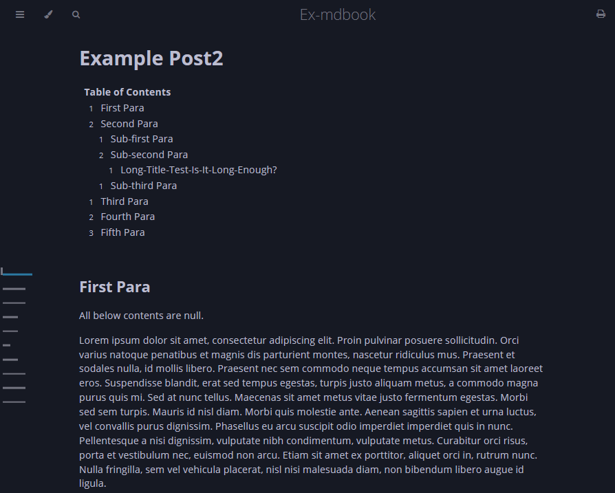
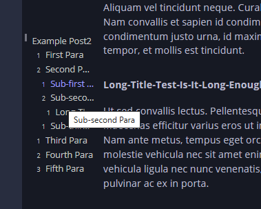

# mdbook-tocjs

[](https://crates.io/crates/mdbook-tocjs)

A [mdbook preprocessor](https://rust-lang.github.io/mdBook/format/configuration/preprocessors.html) which adds extra js and css file for ToC hydration.

This preprocessor does not actually preprocess contents of each chapters. Rather, it adds additional `toc.js` & `toc.css` file to be used to hydrate **ToC**(Table of Contents) block and wing.

* [**Demo page 1**](https://acheul.github.io/mdbook-collectors/posts/toc1.html)
* [**Demo page 2**](https://acheul.github.io/mdbook-collectors/posts/toc2.html)


## The ToC block and wing
Two formats of ToC are available: **block** and **wing**.
> 

The **block** format ToC will be generated at a position where you want to place it. On the above image, "Table of Contents" below the main title is the block ToC.

The **wing** format ToC will be generated at a left side of a post. It will be floating with scroll. Also when you place mouse over the wing, horizontal bars are converting into literals:
> 


## Install
```
cargo install mdbook-tocjs
```

## Use
In a markdown file of a post where you want to make a ToC, include lines like:
```html
<div id="tock"></div>
<div id="tocw"></div>
```

With node whose id is "tock", the preprocessor formats `toc.js` to be able to make a ToC block under the node.

With node whose id is "tocw", the preprocessor formats `toc.js` to be able to make a ToC wing of the post.

You can change actual ids with configuration settings in `book.toml`.

## Arguments
Inside the `toc.js`, toc building methods have some optional arguments. You can pass these options using html's dataset property.

```md
<div id="tock" data-use_number=true data-block_title="Table of Contents"></div>
```
Above code will make ToC block with number prefix for each title and with a top title of "Table of Contents".

Here are available options: (option: type(default) / details)
* use_number: bool(false) / Use number prefix? / for both of `block` and `wing`
* block_title: str("Titles") / top title of `block` ToC
* use_title_name: bool(false) / Use post's title for top title of `wing` ToC
* root_title: str("Title") / top title of `wing` ToC
* bar_unit_size: Int(8) / unit size of bar in `wing` ToC
* wing_left_margin: Int(4) / left margin of `wing` ToC


## Configuration
Default setting (in `book.toml`):
```toml
[preprocessor.tocjs]
save_dir = "lib"
theme_dir = "theme"
block_marker_id = "tock"
wing_marker_id = "tocw"
base_url = "/"
```
### save_dir
The directory where `toc.js` and `toc.css` file will be added to.
This directory is relative to the book's `src` directory.

> 🪧 Mind that the `mdbook serve` watches `src` directory. Once you start `mdbook serve` command then change any contents under `src` directory, the preprocessor may recreate the files and this would lead to a repeat loop of watch and serve. To prevent this, make a **.gitignore** file at the book's root directory and add the `save_dir` which is joined after `src` directory.

### theme_dir
The book's theme directory. The preprocessor automatically creates/revise `head.hbs` file under this directory. Please make sure to match this setting with your `[output.html]`'s `theme` setting.

The created `head.hbs` would look like this:
```hbs
<link rel="stylesheet" href="/lib/toc.css">
<script src="/lib/toc.js"></script>
```

### block_marker_id and wing_marker_id
Literals to be used as nodes' ids in the raw markdown file. The preprocessor formats `toc.js` file to be matched with them.

### base_url
Sync base url. It's used in `head.hbs`.

## More Customization?
You can also use `additional-js` and `additional-css` for more customization. In this case, manually clone and reivse the `toc.js` and `toc.css` file.

## See Also
* [markdown-toc](https://crates.io/crates/markdown-toc)
* [markdown-pagetoc](https://crates.io/crates/mdbook-pagetoc)

## Dev log
* Version `0.1.0` to `0.1.1`
  * added `base_url` to configuration.
* `0.1.3`
  * debugging in case of single post where prev-navigator not exists